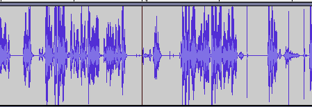
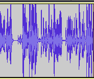

# Trim Silences

Trim silences from `.wav` file. Usually I use for my podcasts, to trim any pauses and silence segments from the source audio. Then I edit more advanced stuff in audio software. Outputs elapsed time and size difference after the execution.

Uses [`pydub`](https://github.com/jiaaro/pydub) library with lots of capabilities to work with mp3/ogg formats, add crossfade and etc.

##### Before

##### After

#### Install requirements
`$ pip install --user --requirement requirements.txt`

### License
MIT. See [LICENSE](LICENSE)

Copyright 2020 Merab Tato Kutalia